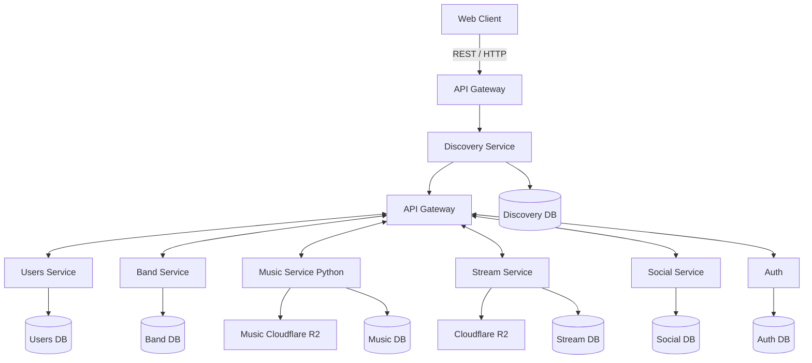
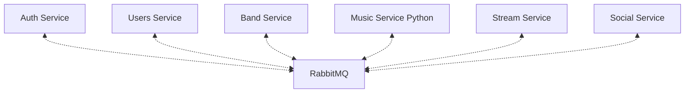

# EchoWave

EchoWave is a distributed music platform inspired by services such as **Bandcamp** and **Soundcloub**.

The project focuses primarily on **backend development, microservice architecture, distributed systems, and DevOps**, while keeping the frontend at a moderate level of complexity.

## Project Overview

EchoWave allows users to:

- Create an account
- Create artist and band profiles
- Upload and publish music
- Create albums and releases
- Listen to music
- Like and comment on music

The platform is divided into several independent microservices, each responsible for a specific domain.

## Architecture

EchoWave uses a **microservice architecture**.

### High-level architecture





## CI/CD Pipeline

EchoWave uses a CI/CD pipeline to automatically test, build, package, and deploy services.

The general workflow is:

```mermaid
graph TD

    Develop[Developer]

    Develop -->|git push| GitHub[GitHub]

    GitHub -->|Trigger| CI[CI]

    CI --> Tests[Tests / Lint / Build]

    Tests --> Images[Docker Images]

    Images --> Registry[Container Registry]

    Registry -->|CD| Kubernetes[Kubernetes]
