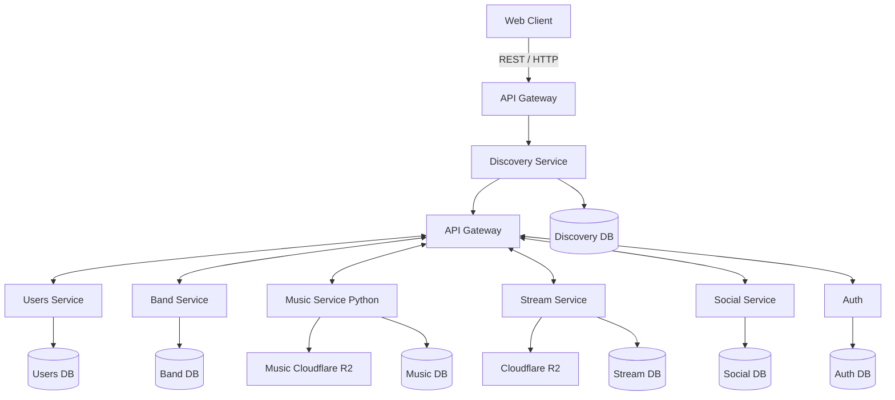
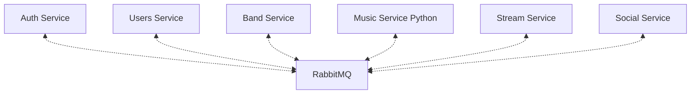
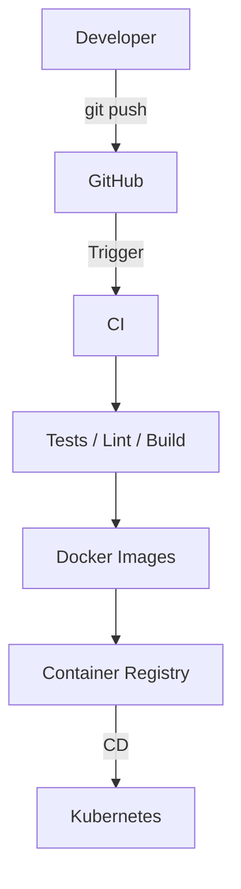

# EchoWave

EchoWave is a distributed music platform inspired by services such as **Bandcamp** and **Soundcloub**.

The project focuses primarily on **backend development, microservice architecture, distributed systems, and DevOps**, while keeping the frontend at a moderate level of complexity.

## Project Overview

EchoWave allows users to:

- Create an account
- Create artist and band profiles
- Upload and publish music
- Create albums and releases
- Listen to music
- Like and comment on music

The platform is divided into several independent microservices, each responsible for a specific domain.

## Architecture

EchoWave uses a **microservice architecture**.

### High-level architecture

## CI/CD Pipeline

EchoWave uses a CI/CD pipeline to automatically test, build, package, and deploy services.

The general workflow is:

## Services

### API Gateway

The API Gateway is the single public entry point of the application.
The frontend communicates with the API Gateway using REST / HTTP.

Responsibilities:
- Handle HTTP requests
- Validate requests
- Authenticate users
- Authorize requests
- Discover service instances
- Communicate with internal services using gRPC
- Return responses to the client

The API Gateway does not contain business logic belonging to other domains.

### Auth Service

The Auth Service is responsible for authentication and account security.

Responsibilities:
- Registration
- Login
- Logout
- Access tokens
- Refresh tokens
- Password management
- Email verification

Authentication is separated from user profile management.

### Users Service

The Users Service is responsible for user profiles.

Responsibilities:
- User profiles
- Usernames
- Avatars
- Profile information
- User preferences

The service does not manage authentication credentials.

### Band Service

The Band Service manages artists and bands.

Responsibilities:
- Artist profiles
- Band profiles
- Band members
- Band management

### Music Service

The Music Service is responsible for the music domain.

Responsibilities:
- Tracks
- Albums
- Releases
- Genres
- Music metadata
- Track ownership
- Artist and release relationships

The Music Service manages information about music, but does not deliver audio to listeners.

### Stream Service

The Stream Service is responsible for delivering music to listeners.

Responsibilities:
- Audio streaming
- HTTP range requests
- Audio delivery
- Artwork delivery
- Streaming optimization
- Caching

The Stream Service retrieves media from object storage and delivers it to the client.

### Social Service

The Social Service handles social interactions.

Responsibilities:
- Likes
- Comments
- Notifications
